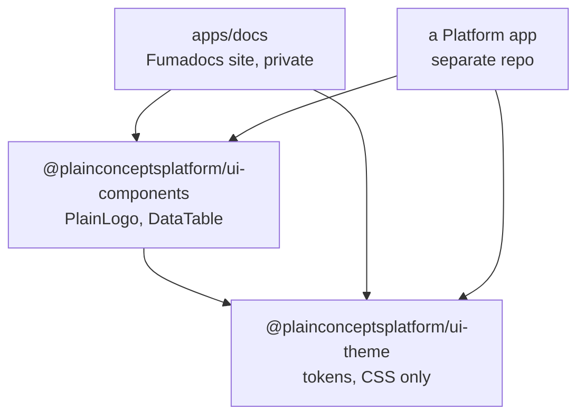
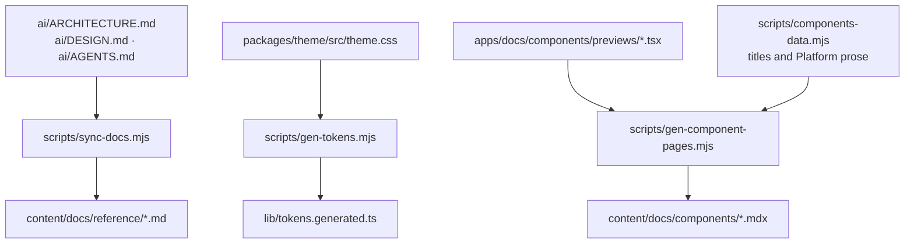
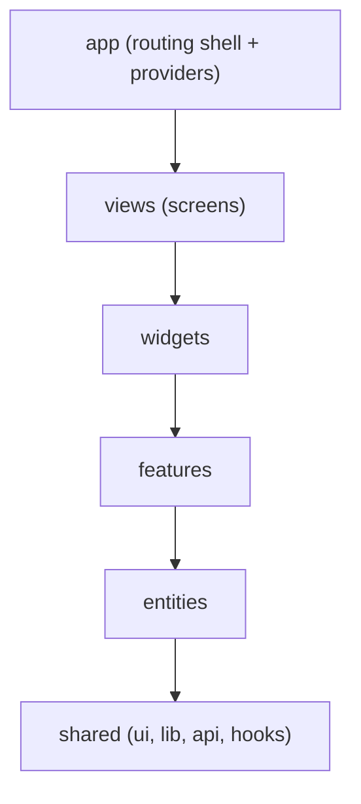
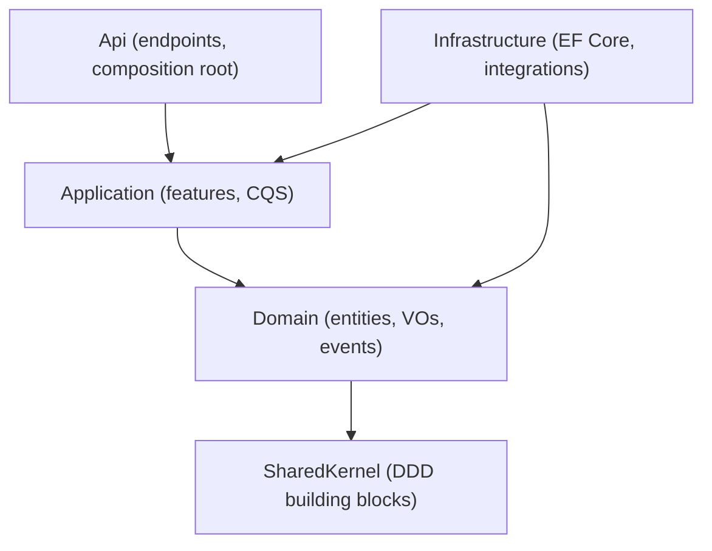

# ARCHITECTURE

Reference architecture for PlainConcepts **Platform** apps (frontend and backend), plus the layout
of this foundation repo. It is intentionally small: it mandates a few rules that matter and leaves
the rest to each team. Start simple; add structure only when it earns its place. Frontend is covered
first; the backend (.NET) architecture is the final section.

## Architecture Overview

- **Foundation repo** (`PlainConceptsPlatform/Foundations`): a pnpm monorepo holding the shared theme package,
  the shared components package, the docs/showcase site, and the conventions in `ai/`. It ships
  tokens + shared components + docs, **not** a full component library.
- **Platform frontend apps** (separate repos): **Next.js (App Router) + React + TypeScript**, using
  **shadcn/ui** components copied in and themed by `@plainconceptsplatform/ui-theme`. Each app
  follows a **pragmatic Feature-Sliced Design (FSD)** structure.
- **Platform backend apps** (.NET): Clean Architecture layers with Vertical Slice Architecture and
  CQS, following the Plain Engineering Excellence conventions. See the Backend architecture section.

## Stack

Every app picks the **same** library for the same job, so codebases (and AI agents) stay
predictable. Prefer these; deviate only with a good reason recorded in the app.

### Core

| Concern | Choice | Notes |
|---|---|---|
| Language | **TypeScript (strict)** | extends `tsconfig.base.json` |
| Framework | **Next.js (App Router)** + **React** | recommended baseline for all apps |
| Package manager | **pnpm** | used everywhere, incl. this repo |
| Components | **shadcn/ui** | copied into the app, on Radix + Tailwind |
| Primitives | **Radix UI** | comes with shadcn |
| Styling | **Tailwind CSS v4** | tokens from `@plainconceptsplatform/ui-theme` |
| Theme | **@plainconceptsplatform/ui-theme** | the Platform styleguide; tokens only |
| Icons | **Lucide** (`lucide-react`) | shadcn default |
| Dependency injection | **inversify + inversify-hooks** | mandatory; see Dependency injection below |
| Internationalization | **react-i18next + i18next** | mandatory; the only translation library. Zero magic strings; every user-facing text is a translation message |

### Feature libraries (shadcn delegates to these, use them directly)

| Need | Choice |
|---|---|
| Forms + validation | **react-hook-form + zod** (`@hookform/resolvers`) |
| Data tables / grids | **TanStack Table** |
| Data fetching / server cache | **TanStack Query** (when not using RSC/Server Actions) |
| Date picker / calendar | **react-day-picker** |
| Charts | **Recharts** |
| Toasts / notifications | **sonner** |
| Command palette | **cmdk** |
| Carousel / Drawer | **embla-carousel** / **vaul** |

### Tooling

| Concern | Choice | Notes |
|---|---|---|
| Lint + format | **Biome** | one tool; see `biome.json` |
| Next-specific lint | **`next lint`** | Biome lacks Next rules, run both |
| Unit / component tests | **Vitest + Testing Library** | |
| E2E tests | **Playwright** | |
| Docs + showcase | **Fumadocs** (Next.js) | `apps/docs` |
| Monorepo | **pnpm workspaces** | no Turborepo/Nx yet |

### Deliberately not standardized

Custom shared business components, auth/API/state-management abstractions, observability or
feature-flag packages, routing wrappers, app-shell components, a custom CLI, project generators,
shared form abstractions, a custom DI framework. Add a shared piece **only** when the same real
requirement has appeared in **multiple** apps.

## Foundation repo structure

```text
Foundations/
├── apps/
│   └── docs/                  # Fumadocs (Next.js), docs + live themed component previews
├── packages/
│   ├── theme/                 # @plainconceptsplatform/ui-theme (design tokens, CSS only)
│   └── ui-components/         # @plainconceptsplatform/ui-components (shared React components)
├── ai/                        # ARCHITECTURE.md (incl. Stack), DESIGN.md, AGENTS.md (source of truth)
├── biome.json · tsconfig.base.json · pnpm-workspace.yaml · package.json
└── .github/workflows/         # CI (Biome + Vitest) and deploy (Fumadocs → Azure App Service)
```

## Foundation repo internals

How this repo produces what it publishes. Worth knowing before changing anything here, because
several artifacts are generated and editing the output instead of the input is the usual mistake.

### Package graph



`ui-theme` has no dependencies of its own beyond a Tailwind peer, which is what keeps it cheap to
adopt. `apps/docs` is private and never published; it consumes both packages through the workspace so
the site always documents the code in the same commit.

### Content pipeline

Three generators run before the site builds. All of their output is committed so it is reviewable in a
diff, and CI fails if regenerating produces a change.



The rule this encodes: **`ai/*.md` and `theme.css` own facts, and the site renders them.** A fact
stated in two places drifts, so narrative pages link to the reference rather than restating a table.

### Release flow

Edit `theme.css`, add a changeset, merge. Merging to `main` opens a "Version Packages" pull request;
merging that publishes both packages to npm with provenance. Apps pick up the change when they bump
the dependency. Nobody publishes from a laptop.

### Deploy topology

`apps/docs` builds with `output: "standalone"` and runs as a Node server on Azure App Service. The
deploy workflow is gated on CI: it triggers on `workflow_run` completion and only proceeds when the
CI conclusion was a success.

## Reference app structure (pragmatic FSD on Next.js)

```text
<app>/
├── src/
│   ├── app/          # Next.js App Router: routing shell only (layouts, segments, route
│   │                 #   handlers) + global providers. FSD "app" concerns live here.
│   ├── views/        # FSD "pages" layer, RENAMED to avoid the Next app/pages collision.
│   │                 #   Composition of a route's screen from widgets/features.
│   ├── widgets/      # (earn it) self-contained UI blocks combining features/entities
│   ├── features/     # (earn it) user interactions / use-cases
│   ├── entities/     # (earn it) business domain models + their UI/api
│   └── shared/
│       ├── ui/       # shadcn components (Radix + Tailwind + Lucide)
│       ├── lib/      # cn(), formatters, pure helpers
│       ├── api/      # API clients / fetchers
│       └── hooks/    # cross-cutting hooks
```

A brand-new app may start with only `app/`, `views/`, and `shared/`. Introduce `widgets/`,
`features/`, and `entities/` **only when a real need appears**, never preemptively.

## Dependency direction

The one hard rule. A layer may import from layers **below** it, never above; siblings do not
import each other (compose them one layer up).



*Rationale:* one-way dependencies keep slices independent and safe to delete/move, and make the
codebase legible to humans and agents, you always know where a thing can live.

## Public APIs for slices

Every slice exposes a single `index.ts` (barrel). Import a slice **only** through its `index.ts`,
never deep-reach into its internals. This makes each slice's surface explicit and refactor-safe.

## Where things belong

- **App initialization / providers**: `src/app` (root layout + a `providers` module).
- **Routing**: Next.js App Router in `src/app`; the screen it renders lives in `views/`.
- **Reusable domain logic**: `entities/` (models, domain rules) and `features/` (use-cases).
- **UI components**: third-party components in `shared/ui` (shadcn); app-specific components in the
  slice that owns them. Do **not** wrap third-party components "just in case".
- **API clients**: `shared/api` (or per-entity `api/`), behind small typed interfaces.
- **Hooks**: cross-cutting in `shared/hooks`; feature-specific inside the feature.

## Dependency injection (inversify-hooks, mandatory)

Frontend apps use **InversifyJS with [`inversify-hooks`](https://github.com/CKGrafico/inversify-hooks)**
as the dependency-injection layer. Depend on interfaces, register implementations in the container,
and resolve them in components through the hooks. This keeps use-cases and API clients swappable and
testable, and gives every app the same wiring pattern.

- Libraries: `inversify` + `inversify-hooks`.
- Register bindings in a composition root under `app/`. Resolve with the provided hook inside
  `views`, `widgets`, and `features`. Keep `entities`/domain code free of the container.
- The underlying principle still holds: depend on abstractions, not concretions. The container is
  how we implement that here.

Because inversify uses decorators, apps need these `tsconfig` compiler options. The shared
`tsconfig.base.json` already sets `experimentalDecorators` and `useDefineForClassFields: false`:

```json
{
  "compilerOptions": {
    "target": "es2020",
    "lib": ["es2020", "dom"],
    "moduleResolution": "bundler",
    "experimentalDecorators": true,
    "useDefineForClassFields": false
  }
}
```

Next.js apps must also enable decorator support in the compiler (SWC/Babel) so decorators work at
runtime, not only in type-checking.

## Testing conventions

- **Vitest + Testing Library** for unit/component tests, co-located as `*.test.ts(x)` next to the
  code. Test behavior via the public API of a slice, not internals.
- **Playwright** for end-to-end flows, in a top-level `e2e/`.
- Every `feature`/`entity` with logic ships tests; UI-only wrappers need not.

## Naming conventions

- Files/folders: `kebab-case`. React components: `PascalCase` export. Hooks: `useX`.
- Slice folders are singular domain nouns (`user`, `invoice`), not `utils`-style grab-bags.
- One barrel `index.ts` per slice; no deep imports across slices.

## When a simpler structure is acceptable

Small/short-lived apps may collapse to `app/ + views/ + shared/`. The dependency direction and
slice public-API rules still apply; the extra layers are optional. Prefer the smallest structure
that stays legible.

## Docs & showcase

`apps/docs` is a **Fumadocs** (Next.js) site rendering these docs plus live, themed component
previews and 2-3 realistic screens. It demonstrates the *theme* and the *shared components*
(from `@plainconceptsplatform/ui-components`); it links out to shadcn's official
docs rather than re-documenting component APIs. Deployed to Azure App Service, with Entra ID login via App Service Authentication.

## Backend architecture (.NET)

Reference for Platform .NET/C# backends. The source of truth is the Plain **Engineering Excellence**
skills; this section summarizes them and shows how a Platform .NET app applies them.

### Recommended skills (source of truth)

Two skills, published to [`PlainConcepts/skills`](https://github.com/PlainConcepts/skills) as the
`pc-companion` plugin:

| Skill | Scope | Covers |
|---|---|---|
| `plain-engineering-conventions` | Language-agnostic | Architecture principles, error handling, observability, DI, testing, security, CI/CD, linting |
| `plain-dotnet-guardrails` | .NET / C# | VSA + CQS, EF Core, Aspire, DI (Scrutor), logging, build hygiene, Central Package Management, `.editorconfig`, architecture tests |

Both are reference-only (they do not scaffold). The `pc-companion` agent analyzes a project against
these conventions and produces a `findings-report.md`. It coaches, it does not police.

### Core engineering principles

From `plain-engineering-conventions`:

| # | Principle | One-liner |
|---|---|---|
| 1 | Repository Structure | Standard layout, mandatory docs, root config files |
| 2 | Result-Oriented Errors | Domain errors as values, not exceptions, plus RFC 7807 |
| 3 | Explicit Boundaries | Public interfaces between components; no coupling to internals |
| 4 | Observability by Default | Structured logging, distributed tracing, metrics |
| 5 | Convention over Configuration | Auto-discovery of handlers, validators, modules |
| 6 | Architecture as Code | Enforce rules with tests and linters, not just docs |
| 7 | Everything as Code | IaC, CI/CD, GitOps; nothing manual |
| 8 | Code Quality and Linting | Automated formatting and static analysis, enforced in CI |
| 9 | Security by Default | Vulnerability scanning, dependency auditing, secret detection in CI |
| 10 | Testing Strategy | A deliberate pyramid: unit, integration/functional, E2E |

### .NET stack and guardrails

From `plain-dotnet-guardrails`:

- **Architecture:** Vertical Slice Architecture (feature per folder) with **Command/Query
  Separation**, organized as a **modular monolith** (a module is a bounded context). Add modules only
  when a real boundary exists.
- **Errors:** the `ErrorOr` result pattern mapped to **RFC 7807 ProblemDetails**. Domain errors are
  return values, not thrown exceptions.
- **Dependency injection:** convention-based registration with **Scrutor** assembly scanning.
- **Persistence:** **EF Core**.
- **Orchestration:** **Aspire** conventions for resources and connection strings.
- **Build hygiene:** `Directory.Build.props` / `.targets`, **Central Package Management**
  (`Directory.Packages.props`), and a `.editorconfig` whose rules are enforced in CI.
- **Architecture tests:** a dedicated test project asserts layer and dependency rules.
- **Logging:** `ILogger<T>` with structured logs and sensible levels.

### Reference architecture (Clean Architecture layers)

A Platform .NET API is organized into layered projects:

| Project | Responsibility |
|---|---|
| `Domain` | Domain model (entities, value objects, domain events). No outward dependencies. |
| `SharedKernel` | Shared DDD building blocks and base types. |
| `Application` | Use-cases and DTOs, organized **by feature** (vertical slices). Depends on Domain. |
| `Infrastructure` | EF Core, external integrations. Implements Application/Domain interfaces. |
| `Api` | Minimal-API endpoints grouped by feature (`Endpoints/<Feature>/...`). Composition root. |
| `Gateway`, `Seed` | Supporting services (edge/gateway, data seeding). |
| `UnitTests`, `IntegrationTests`, `E2ETests` | The test pyramid. |

Dependency direction (inner layers know nothing about outer layers):



Inside each layer, work is grouped **by feature**: an endpoint maps to an application command/query,
which uses the domain and persists through infrastructure.

> The libraries above (`ErrorOr`, Scrutor, Aspire, EF Core) are the Plain conventions and
> recommended defaults; confirm each in a given app rather than assuming it.

### When to use what

- **A service or small app:** a few layered projects (Domain, Application, Infrastructure, Api) with
  feature folders inside. This is the default.
- **A larger system:** a modular monolith where each module is a bounded context and is internally
  VSA + CQS. Split into separate deployables only when a boundary genuinely demands it.

Do not add modules, layers, or a mediator preemptively.

### Backend testing

Follow the pyramid: many **unit** tests (xUnit), fewer **integration/functional** tests (a real host
via `WebApplicationFactory`, a real database via Testcontainers), and a few **E2E** tests. Keep
unit, integration, and end-to-end tests in separate projects.

### Everything as code, security, observability

Infrastructure, pipelines, and configuration live in the repo (IaC, CI/CD, GitOps). Security checks
(dependency and secret scanning, SAST) run in CI. Observability uses structured logging and
OpenTelemetry.

<!-- Last updated: 2026-07-23 -->
