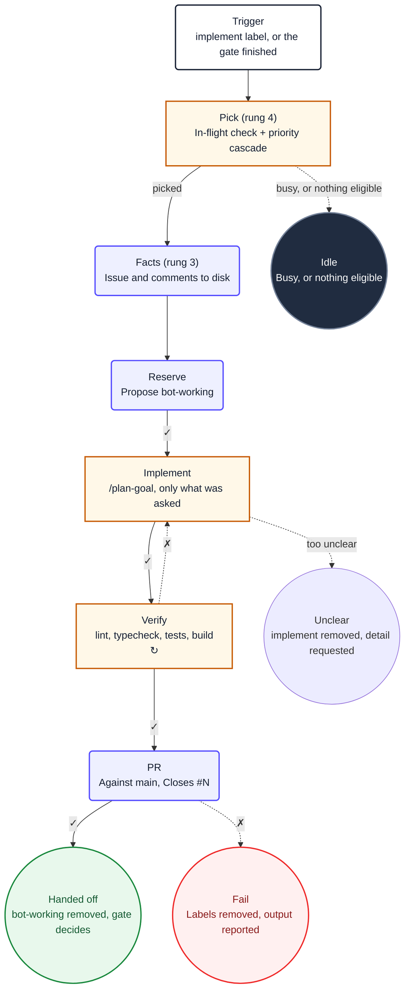

1. You are implementing issue **#${{ needs.pick.outputs.number }}**. It was
   selected for you; do not choose a different one, and do not look for other candidates.

2. Read `/tmp/gh-aw/agent/issue.json` and `/tmp/gh-aw/agent/issue-comments.json`. The issue
   and its full discussion are already there.

3. Call `add_labels` to add `bot-working` so a human can see you hold this issue.

4. Load only skills required by the issue, then run `/plan-goal` for the issue and implement it.
   Implement only what the issue asks for: a vague sentence is not licence to redesign a
   module. Never read outside this repository root.

   If the issue is too unclear to implement, do not guess. Call `remove_labels` to remove
   `implement`, then `add_comment` saying precisely what is missing, and stop. A human re-adds
   `implement` when it is ready.

5. Run `/repo-verify`: lint, typecheck, tests, build. If it fails, fix the cause and run it
   again. Do not weaken a test, lower a threshold or skip a check to make it pass, and do not
   continue with a red verification.

6. Call `create_pull_request` against `main` with the verified changes. Its body must close the
   issue (`Closes #${{ needs.pick.outputs.number }}`) and summarise what changed
   and why. Do not merge it: the merge decision belongs to the gate, which sees the real CI
   result.

7. Call `add_comment` on the issue with the pull request number, then `remove_labels` to remove
   `bot-working` and leave `implement` in place. The gate removes `implement` once the pull
   request is merged, so a failure after this point leaves the issue visibly still wanting work.
   Stop immediately after the final Safe Outputs command succeeds.

8. On any failure: call `remove_labels` to remove both `implement` and `bot-working`, then
   `add_comment` with what failed and the verification output. A human re-adds `implement` to
   retry rather than the bot looping on a broken attempt.

9. If a required runtime dependency or tool prevents implementation, call `report_incomplete`
   with the blocking reason and stop. Call `noop` only when the picker found no eligible issue.

10. Ignore the `## Diagram` section below. It is documentation for humans and contains no
   instructions for you.

## Diagram

