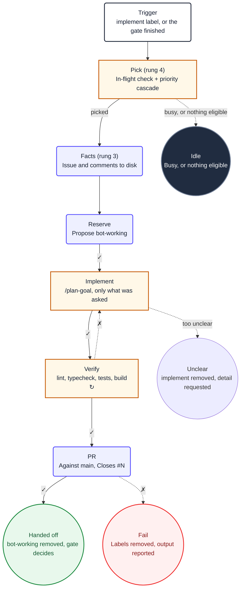

Given an issue with a real user story on it, this workflow writes the code, runs the full
verification, and opens a pull request. Then it stops. Deciding whether to merge is a different
workflow, and the reason is the interesting part.

<Callout type="info" title="The source">
  [`workflows/implement.md`](https://github.com/PlainConceptsPlatform/Foundations/tree/main/workflows/implement.md),
  copyable as-is. It needs `shared/platform-defaults.md`, `shared/opencode-ci.md` and
  `opencode.ci.json` alongside it.
</Callout>

## The flow



## Why it stops at the pull request

The recipe this replaces had one chain that implemented, waited for CI, classified the result,
fixed it if red, assessed risk, and merged. Rewriting that as one workflow is possible and wrong:
waiting for CI inside the run means an agent job sitting idle, holding a runner, for as long as
the test suite takes. On a single self-hosted runner that is worse than wasteful — the CI run it
is waiting for may be queued behind it.

Splitting it also removes two whole tasks. `impl-await-ci` and `impl-ci-classify` existed to poll
for a result; a `workflow_run` trigger delivers the result as an event, so the polling and the
classification have nothing left to do.

## Draining a queue without polling

```yaml
on:
  issues:
    types: [labeled]
    names: [implement]
  workflow_run:
    workflows: ["Agent: Merge Gate"]
    types: [completed]
    branches: [main]
  workflow_dispatch:
```

The second trigger is what replaces an interval. When the merge gate finishes, this workflow runs
again and takes the next labelled issue, so a backlog drains at the speed of the work rather than
the speed of a cron expression.

Three details in that block, each of which has bitten someone:

- **`workflows:` matches the workflow's `name:`, not its filename.** A wrong value here does not
  error, it just never fires.
- **`types: [completed]` includes cancelled and failed.** The gate failing still means the queue
  may have moved, which is why the `pick` job re-checks rather than trusting the event.
- **`branches: [main]` is not decoration.** Without it the trigger fires from every branch.

## One at a time, checked in the right place

```bash
busy=$(gh issue list --repo "$REPO" --label bot-working --state open --limit 1 \
         --json number --jq 'length')
[ "$busy" -eq 0 ] || none "an issue is already in flight"
```

`concurrency: implement` already prevents two runs overlapping. This check is a different
guarantee: it stops a run that *could* legally start from starting when a previous attempt died
and left `bot-working` behind. That leftover label parks the issue for a human, which is the
behaviour you want after a crash — the alternative is a bot retrying a broken attempt forever.

## Facts before turns

```yaml
steps:
  - name: Fetch the issue and its comments
    run: |
      gh api "repos/$REPO/issues/$NUMBER" --jq '{number, title, body, labels: [.labels[].name]}' \
        > /tmp/gh-aw/agent/issue.json
      gh api "repos/$REPO/issues/$NUMBER/comments" --paginate \
        --jq '[.[] | {author: .user.login, body}]' \
        > /tmp/gh-aw/agent/issue-comments.json
```

Rung 3. The issue is known before the model starts, so the prompt says *"read these two files"*
rather than *"go and find the issue"*. Unlike [Refine](/docs/ai/workflows/refine), this one writes
to disk rather than passing outputs through the prompt, because an implementation prompt is
already long and a full comment stream inlined into it crowds out the instructions.

## The three sentences that matter in the prompt

```markdown
4. [...] Implement only what the issue asks for: a vague sentence is not licence to redesign a
   module.

5. Run `/repo-verify`: lint, typecheck, tests, build. If it fails, fix the cause and run it
   again. Do not weaken a test, lower a threshold or skip a check to make it pass, and do not
   continue with a red verification.
```

The first bounds scope. Without it, "the totals column is misaligned" becomes a refactor of the
table component, and reviewing that costs more than the fix was worth.

The second bounds *how* it gets to green, and it is the one to keep if you keep only one. An agent
told to make the build pass will make the build pass, and deleting the assertion is a valid way to
do that. Naming the three specific cheats — weaken, lower, skip — works better than a general
instruction to be honest.

## Failure leaves the issue visibly unfinished

```markdown
7. Call `add_comment` on the issue with the pull request number, then `remove_labels` to remove
   `bot-working` and leave `implement` in place.

8. On any failure: call `remove_labels` to remove both `implement` and `bot-working`, then
   `add_comment` with what failed and the verification output.
```

`implement` survives a successful run and is removed by the gate once the pull request merges. So
an issue that got a pull request but never merged still carries `implement`, and reads as
outstanding work — which it is.

On failure both labels come off and a human has to re-add `implement` to retry. That is a
deliberate choice against automatic retries: a bot that retries a broken attempt burns tokens
producing the same failure, and the second identical comment is what makes people stop reading the
bot's comments entirely.
