<Callout type="info" title="This is the recommendation">
  For work that reacts to a repository event, Agentic Workflows on a self-hosted runner is the
  Platform default. [`loop-task` is the fallback](/docs/ai), for work with no event to react to
  or no runner to run on.
</Callout>

A workflow is a single markdown file in `.github/workflows/`. **The body is the prompt** and the
YAML frontmatter is the wiring: when it fires, where it runs, and what it is allowed to write.
`gh aw compile` turns it into a `.lock.yml` sibling, and that lock file is what Actions actually
executes.

Install the extension and the Platform skill:

```bash
gh extension install github/gh-aw
npx skills add plainconceptsplatform/foundations
```

Copyable examples live in [`workflows/`](https://github.com/PlainConceptsPlatform/Foundations/tree/main/workflows)
in this repository. Two are documented in full:

| Workflow | What it does |
|---|---|
| [**Refine**](/docs/ai/workflows/refine) | Turns an issue into a user story, or asks the author questions |
| [**Implement**](/docs/ai/workflows/implement) | Implements an issue, verifies it, opens a pull request |

## The label system

Labels are the state machine. They are how a human sees where an issue is, and how a workflow
decides what to pick next. This is a deliberately smaller set than
[the loop-task recipes use](/docs/ai/recipes): those namespace every state
(`refine:pick`, `refine:doing`, `refine:done`), which an event-driven workflow does not need
because the event carries the transition.

| Label | Meaning | Written by |
|---|---|---|
| `refine` | Wants refinement, or is waiting on the author's answers | Human, removed by Refine |
| `refined` | Has a user story, ready for a human to approve | Refine |
| `implement` | Approved for implementation | Human, removed by the merge gate |
| `bot-working` | An agent holds this issue right now | Implement |
| `review` | Needs a human on the pull request | The merge gate |
| `priority` | Escalation. Changes pick order, never lifecycle | Human |
| `bug` | A defect. Changes pick order, never lifecycle | Human |

`bot-working` is worth a note, because it looks like a lock and is not one. The real lock is the
`concurrency` group. The label exists because humans read it, and because a run that dies leaves
it behind — which correctly parks the issue for a person instead of letting the next run pick it
up.

### Priority cascade

Both workflows select the **lowest-numbered** eligible issue from the first non-empty tier. An
urgent issue labelled today must still be served before an older ordinary one, which a plain
"oldest first" query gets wrong.

1. `priority` + `bug` + the entry label
2. `priority` + the entry label
3. `bug` + the entry label
4. The entry label alone

```bash
pick() {
  gh issue list --repo "$REPO" --label "$1" --state open --limit 1000 \
    --json number,labels \
    --jq '[.[] | select(any(.labels[].name; . == "bot-working") | not)]
          | sort_by(.number) | .[0].number // empty'
}

number=$(pick "priority,bug,implement")
[ -n "$number" ] || number=$(pick "priority,implement")
[ -n "$number" ] || number=$(pick "bug,implement")
[ -n "$number" ] || number=$(pick "implement")
```

`--repo` is not optional. The cascade runs in a custom job, which has no checkout, so `gh` cannot
infer the repository from a git remote and fails with `fatal: not a git repository`.

### Lifecycle

```mermaid
flowchart LR
    new("Issue opened") -->|human adds refine| refine
    refine["refine"] -->|questions| waiting
    waiting["refine<br/>awaiting the author"] -->|author replies| refine
    refine -->|story complete| refined
    refined["refined"] -->|human adds implement| implement
    implement["implement"] -->|agent starts| working
    working["implement + bot-working"] -->|PR opened| review
    review["implement + review"] -->|gate merges| closed
    closed(("Closed"))

    classDef start fill:#ffffff,stroke:#172033,stroke-width:2px,color:#172033
    classDef action fill:#eef0ff,stroke:#554cff,stroke-width:2px,color:#172033
    classDef decision fill:#fff8e8,stroke:#c75b00,stroke-width:2px,color:#172033
    classDef idle fill:#202c40,stroke:#738198,stroke-width:2px,color:#ffffff
    classDef success fill:#e8f8ec,stroke:#18883c,stroke-width:2px,color:#145a32

    class new start
    class refine,refined,implement,working,review action
    class waiting idle
    class closed success
```



Two transitions are deliberately human: adding `refine` in the first place, and adding
`implement` once a story exists. Everything between them is an agent, and everything an agent
writes goes through safe outputs.

## The determinism ladder

The central idea, and the thing that separates a workflow that behaves from one that surprises
you: **the model is the last resort, not the engine.** Every rung below the agent is deterministic,
cheaper, and cannot hallucinate. Push work down as far as it will go.

| Rung | Mechanism | Use it for |
|---|---|---|
| 0 | The trigger | Deciding *that* there is work |
| 1 | Trigger filters — `names`, `roles`, `reaction` | Who may start a run at all |
| 2 | `pre-agent-steps` | Runtime setup the agent needs but should not perform |
| 3 | `steps` (precompute) | Facts the agent would otherwise spend turns fetching |
| 4 | Custom `jobs` | Choices with an exact answer, like the cascade |
| 5 | The agent | Judgement, prose, code |
| 6 | `safe-outputs` | Every write, applied by the framework |

The full rung-by-rung contract is in the
[`platform-agentic-workflows` skill](https://github.com/PlainConceptsPlatform/Foundations/tree/main/skills/platform-agentic-workflows).

### Why the cascade is a custom job and not `on.steps`

`on.steps` looks like the right rung and is not, for a mechanical reason worth knowing before you
spend an hour on it. Its outputs land on the `pre_activation` job, which the agent job does not
depend on, so `needs.pre_activation.outputs.*` reaches the prompt as an **empty string** — no
error, no warning. Custom jobs are added to the agent job's `needs` by the compiler, so their
outputs genuinely arrive.

## The frontmatter contract

Every Platform agentic workflow sets these. The first two are the ones people forget.

```yaml
name: "Agent: Refine Issue"        # workflow_run matches this, not the filename

imports:
  - shared/platform-defaults.md
  - shared/opencode-ci.md

runs-on: ubuntu-latest
runs-on-slim: ubuntu-latest        # without this, framework jobs run elsewhere

engine:
  id: opencode
  version: "1.2.14"
  env:
    OPENAI_BASE_URL: https://forge.plainconcepts.com/v1

model: openai/glm-5-2             # `openai` only satisfies gh-aw's validation

permissions: read-all              # every write goes through safe-outputs

safe-outputs:
  add-comment:
    target: "*"

concurrency:
  group: refine                    # the real lock
  cancel-in-progress: false
```

### Shared components

A shared component is a `.md` with no `on:`, so it is validated but never compiled on its own.
**Not everything can live there**, and the failure mode of guessing wrong is silent. Verified
against gh-aw v0.83.4 by compiling and reading the lock file:

| Field | Merges from an import? |
|---|---|
| `network` | Yes, allowed domains are unioned |
| `safe-outputs.threat-detection` | Yes, alongside the importer's own safe outputs |
| `steps` / `pre-agent-steps` / `post-steps` | Yes, prepended (appended for post) |
| `tools` / `mcp-servers` / `env` / `checkout` | Yes |
| `permissions` | **No** — validation only |
| `engine` / `model` | **No** — silently not merged |
| `runs-on` / `runs-on-slim` | **No** — warns about unexpected fields |
| `on:` and its filters | **No**, except `skip-*` keys |

`permissions` is the dangerous row. `permissions: read-all` in a shared file compiles without a
warning and the agent job silently falls back to `contents: read`. Every workflow therefore keeps
its own copy, and so do `engine`, `model`, `runs-on` and `runs-on-slim`.

## Two traps worth knowing

### `engine.args` is discarded

Reaching for `args: ["--model", "plainconcepts/glm-5-2"]` to be explicit about the model is a
reasonable instinct and it does nothing. The compiler drops it: a lock built with that block is
byte-identical to one built without, with no `--model` anywhere in it and `OPENCODE_MODEL` set to
gh-aw's own `awf-proxy/glm-5-2` either way. Verified on gh-aw v0.83.4 by compiling both.

The model therefore comes from `model:` plus whatever `opencode.ci.json` declares, and the
provider is selected by gh-aw rather than by you. Do not add `args` expecting to override it.

### `workflow_run` matches the name, not the filename

gh-aw title-cases a filename into a workflow name unless you set `name:` explicitly, so
`merge-gate.md` becomes `Merge Gate`. Referencing the filename in `workflow_run.workflows` is not
an error — the trigger simply never fires, silently, forever. Set `name:` in every workflow and
check the references in CI.

### `names:` does not stop the run, only the agent

GitHub Actions has no native label filter for `issues: [labeled]`, so a run is created for
**every** label added to **any** issue. `names: [refine]` is a gh-aw construct compiled into the
activation job's condition, and activation runs *after* your custom jobs. Without a guard, adding
an unrelated label starts a run whose cascade burns a runner before activation skips everything:

```yaml
if: >
  github.event_name != 'issues' || github.event.action != 'labeled' ||
  github.event.label.name == 'refine'
```

The run still appears in the Actions tab, greyed out with every job skipped. That is the floor:
you can remove the runner cost, not the run entry.

## Where these run

A self-hosted runner is the recommendation, because the credentials and the model gateway stay on
a machine you own. It is not free, and these are the requirements rather than nice-to-haves:

- **Disk, more than you think.** Each agentic run pulls gh-aw's firewall containers; each CI run
  writes a tool cache; scanners pull their own images. A 29 GB disk running both filled to 100%
  and the runner's worker was killed mid-job — which presents as a workflow that hangs, not as an
  error. Budget 64 GB and alert on free space.
- **More than one runner instance.** One runner serialises everything, so a pull-request check
  waits behind a 90-minute agent run. Two instances on one machine is usually enough.
- **A watch on the runner being offline.** A cancelled job can leave a stale session
  (`A session for this runner already exists`), and the symptom is jobs queuing forever with
  nothing failing. Without an alert, nobody notices.

Everything targets the runner in four places, and missing any one of them leaves work on
GitHub-hosted machines: `runs-on`, `runs-on-slim`, `safe-outputs.threat-detection.runs-on`, and
`maintenance.runs_on` in `.github/workflows/aw.json` for the generated maintenance workflow.

## Compiling is not working

`gh aw compile` writes the `.lock.yml`, and Actions runs the lock. A `.md` edited without
recompiling leaves the old behaviour running, silently. Guard it in CI:

```bash
gh aw compile
git diff --exit-code -I 'GH_AW_INFO_MODEL_COSTS' -- '.github/workflows/*.lock.yml'
```

The `-I` is not optional. gh-aw embeds the model's price at compile time, and those figures move
between compilations — within one CI run we saw an input cost of `1.2e-06` on one workflow and
`1.4e-06` on another. Without ignoring that line the check can never pass.
