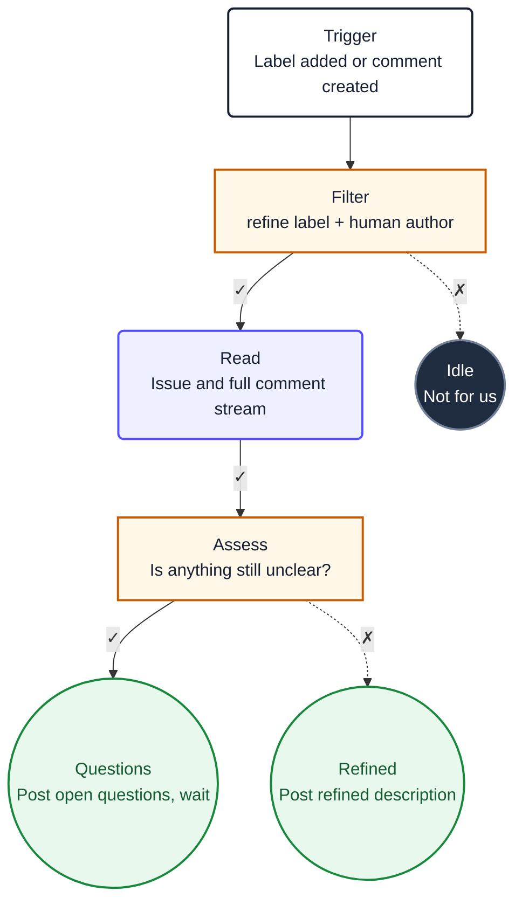

# Platform Agentic Workflows

A GitHub Agentic Workflow is a **markdown file whose body is the prompt**. The YAML
frontmatter is wiring: when it fires, where it runs, what it may touch, what it may write.
Everything below the frontmatter is fed to the model as instructions.

Hold that sentence in your head, because it is the source of every mistake in this format.
A heading you added for humans is an instruction. A Mermaid diagram at the bottom is an
instruction. This skill exists to make the wiring correct and to keep the documentation out
of the prompt.

## Scope

This skill covers **Platform conventions only**. It deliberately does not teach the format.

For authoring mechanics, `gh aw compile`, `gh aw trial`, debugging failed runs, and the
frontmatter reference, use GitHub's own first-party skill, installed by `gh aw init` at
`.github/skills/agentic-workflows/SKILL.md`. Do not reimplement it here.

What is ours, and what this skill is for:

1. The frontmatter contract every Platform workflow must satisfy.
2. Events over schedules, with the mapping.
3. The Mermaid diagram convention, shared with `.loops/recipes/`.
4. Token telemetry reported onto the issue.

## Your task

1. **Establish the trigger.** Decide whether the work reacts to a repository event or to a
   clock, and write the `on:` block. Completion criterion: a schedule appears only when no
   event can express the trigger, and the reason is stated in a comment.

2. **Wire the frontmatter contract.** Runner, engine, network, permissions, safe-outputs,
   timeout. Completion criterion: every entry in the Frontmatter contract below is present
   or consciously omitted with a comment saying why.

3. **Write the prompt body.** Numbered, sequential, imperative. Completion criterion: a
   reader can follow it without knowing the YAML, and the last numbered step tells the model
   to ignore the `## Diagram` section.

4. **Render the diagram.** Map the workflow to a Mermaid flowchart under a final
   `## Diagram` heading, using the class definitions verbatim. Completion criterion: every
   quality gate passes.

## Leading word: prompt

The body is the **prompt**. Not documentation, not a README, not a description of the
workflow. When you write a sentence in the body, ask whether you would say it to an engineer
you were handing the task to. If the answer is no, it does not belong in the body, or it
belongs under `## Diagram` with the exclusion line in place.

## Frontmatter contract

Platform repositories run agentic workflows on **our self-hosted runner** with **our
opencode**. Both are mandatory, and each has a trap.

```yaml
# WHEN. Prefer an event. See the mapping below.
on:
  issues:
    types: [labeled]

# WHERE. Both keys are required.
#   runs-on      the agent job
#   runs-on-slim the framework jobs (activation, safe-outputs, APM, cache)
# Omitting runs-on-slim silently sends the framework jobs to a GitHub-hosted
# ubuntu-slim, which defeats the point and leaks work off the runner.
runs-on: [self-hosted, linux, agents]
runs-on-slim: [self-hosted, linux, agents]

# WHAT MODEL. The local binary, so it uses the session already authenticated on
# that machine rather than an API key.
engine:
  id: opencode          # experimental in gh-aw
  command: /usr/bin/opencode

# WHAT IT MAY REACH. Self-hosted runners need this stated explicitly.
network:
  allowed:
    - defaults

# WHAT IT MAY READ. Start read-only and widen only with a reason.
permissions: read-all

# WHAT IT MAY WRITE. The agent proposes; the framework writes. Never grant write
# permissions to do by hand what a safe-output already does.
safe-outputs:
  add-comment:
  push-to-pull-request-branch:

timeout-minutes: 20
```

### Runner requirements

The runner must be Linux with a working Docker daemon and Node.js available. Write transient
state to `$RUNNER_TEMP`, never a hardcoded path: it is cleaned between jobs. Do not assume
root, and do not install into shared system paths.

<!-- Known upstream issue: runs-on can revert to defaults after `gh aw upgrade` or
     `gh aw compile`. Re-check both runner keys after either command. -->

### Never on a public repository

A self-hosted runner on a public repository lets a pull request from a fork execute arbitrary
code on it, with whatever credentials it holds. Private and internal repositories only. If
the repository is public, this skill does not apply and the work stays on `loop-task`.

## Events over schedules

A schedule is a fallback, not a default. An interval means latency up to the interval and a
run every interval that usually finds nothing to do. Most of the state machinery in a polling
loop exists only because polling cannot see what changed.

| The work starts when | Trigger |
|---|---|
| A label is added | `issues: [labeled]`, then filter on the label |
| Someone replies on an issue | `issue_comment: [created]` |
| Someone reviews or comments on a PR | `pull_request_review_comment: [created]`, `pull_request_review: [submitted]` |
| A PR opens or updates | `pull_request: [opened, synchronize]` |
| A workflow finishes | `workflow_run: [completed]` |
| A human asks | `slash_command`, or `workflow_dispatch` |
| Genuinely a clock (audits, reports) | `schedule` |

Two consequences worth planning for:

- **You do not need to detect who acted.** The event tells you. Filter with
  `github.event.comment.author_association` rather than reading the comment stream to work
  out whether the last commenter was a human.
- **Exclusivity is `concurrency`, not a label.** A polling loop coordinates with an
  in-progress label because several loops share one working tree. Actions gives you a real
  lock:

  ```yaml
  concurrency:
    group: implement-${{ github.repository }}
    cancel-in-progress: false
  ```

  Keep an in-progress label only if humans need to see the state, not to prevent overlap.

## The diagram

Every Platform workflow ends with a Mermaid flowchart, the same convention as
`.loops/recipes/*.yaml`, so a reader moving between them sees one visual language.

### The prompt must exclude it

The body is the prompt, so the diagram would be read as instructions. Two things are required
and neither is optional:

1. The diagram lives under a final `## Diagram` heading, after every numbered step.
2. The last numbered step of the prompt says, verbatim:

   > Ignore the `## Diagram` section below. It is documentation for humans and contains no
   > instructions for you.

### Node shapes and classes

Nodes are classified by **role**, matching the recipe convention.

```
ROLE          SHAPE            CLASS      FILL       WHEN
─────────     ──────           ─────      ────       ────
Trigger       ("label")        start      white      Exactly one per diagram. The `on:`
                                                     event. No edges in.

Decision      ["label"]        decision   orange     A step with both a pass and a fail
                                                     path (a gate, a check, a filter).

Action        ("label")        action     purple     A linear step: checkout, the agent
                                                     run, a verification.

Safe output   (("label"))      success    green      A terminal that writes: comment
                                                     posted, branch pushed, issue closed.

Failure end   (("label"))      failure    red        A terminal failure path: labels
                                                     removed, details reported.

Idle end      (("label"))      idle       dark grey  A terminal no-op: the filter did not
                                                     match, nothing to do.
```

### Class definitions (copy verbatim)

```
classDef start fill:#ffffff,stroke:#172033,stroke-width:2px,color:#172033
classDef action fill:#eef0ff,stroke:#554cff,stroke-width:2px,color:#172033
classDef decision fill:#fff8e8,stroke:#c75b00,stroke-width:2px,color:#172033
classDef idle fill:#202c40,stroke:#738198,stroke-width:2px,color:#ffffff
classDef failure fill:#fff0f0,stroke:#ef2929,stroke-width:2px,color:#8b1a1a
classDef success fill:#e8f8ec,stroke:#18883c,stroke-width:2px,color:#145a32
```

### Glyph map

```
CONCEPT                   MERMAID                                  NOTES
───────                   ───────                                  ─────
Direction                 flowchart TD                             always top-down

Trigger node              prefixStart("Trigger<br/>event")         one per diagram
                                                                   class: start

Pass path                 -->|✓| target                            solid arrow

Fail path                 -.->|✗| target                          dashed arrow

Retry / back-edge         ↻N appended to the node label            only on the node the
                                                                   cycle returns to

Node IDs                  camelCase                                Mermaid rejects hyphens.
                                                                   `implement-verify` becomes
                                                                   `implementVerify`. Never
                                                                   use `end`.

Labels                    id["Short name<br/>Purpose"]             two lines, each under
                                                                   40 characters, `<br/>`
                                                                   for the break
```

## Token telemetry

Every workflow reports what it spent, onto the issue it worked on. Two sources, in this
order.

**opencode is the source of truth.** It emits JSONL with token counts and cost. This is the
same data `loop-task` surfaced as `{{opencode.tokens}}` and `{{opencode.cost}}`, so the
parsing is already understood, and it does not depend on whether gh-aw's proxy observed the
traffic. With `engine: opencode` pointed at a local binary on a subscription, the traffic
very likely does **not** pass through gh-aw's API proxy, which means
`sandbox/firewall/logs/api-proxy-logs/token-usage.jsonl` may be absent and
`max-ai-credits` may never engage. Do not rely on either as the only source.

**gh-aw's proxy metrics are the extra.** When present, `gh aw logs` and
`gh aw audit <run-id>` give duration, tokens, AI Credits and turn count per run, and
`gh aw logs --format markdown` gives a cross-run report with anomaly detection.

**Report it from a separate workflow, not from each workflow.** A `workflow_run` tracker
means one implementation, and a failure in the reporting cannot fail the work:

```yaml
on:
  workflow_run:
    workflows: [implement, refine]
    types: [completed]
safe-outputs:
  add-comment:
    target: "*"
```

## Quality gates

All must pass before the workflow is committed.

- [ ] `on:` uses an event, or a comment states why a schedule was unavoidable
- [ ] Both `runs-on` and `runs-on-slim` are set to the self-hosted labels
- [ ] The repository is private or internal, never public
- [ ] `engine.id` is `opencode` and `engine.command` points at the binary on the runner
- [ ] `network.allowed` is explicit
- [ ] Writes go through `safe-outputs`, not through granted write permissions
- [ ] `timeout-minutes` is set
- [ ] A `concurrency` group exists wherever two runs must not overlap
- [ ] Transient state uses `$RUNNER_TEMP`
- [ ] The prompt body is numbered and imperative
- [ ] The final numbered step contains the `## Diagram` exclusion line
- [ ] The diagram is the last section, under `## Diagram`
- [ ] Exactly one trigger node, class `start`
- [ ] Every pass path is `-->|✓|`, every fail path is `-.->|✗|`
- [ ] All six `classDef` lines are present verbatim
- [ ] Node IDs are camelCase, none is `end`
- [ ] Token telemetry is reported onto the issue by the tracker workflow
- [ ] `gh aw compile` succeeds and both runner keys survived it

## Worked example

`.github/workflows/refine.md`

```markdown
---
description: |
  Refines an issue when a human asks for it, or when the author replies to the
  bot's questions.

on:
  issues:
    types: [labeled]
  issue_comment:
    types: [created]

runs-on: [self-hosted, linux, agents]
runs-on-slim: [self-hosted, linux, agents]

engine:
  id: opencode
  command: /usr/bin/opencode

network:
  allowed:
    - defaults

permissions: read-all

safe-outputs:
  add-comment:

concurrency:
  group: refine-${{ github.event.issue.number }}
  cancel-in-progress: false

timeout-minutes: 20
---

1. Stop unless this issue carries the `refine` label. On a comment event, stop
   unless the comment author is an owner, member or collaborator, and stop if the
   comment was written by you.
2. Read the issue and every comment on it.
3. Refine the issue: restate the goal, list the acceptance criteria, and name the
   files most likely to change.
4. If anything material is still unclear, post one comment containing only the
   open questions, and stop.
5. If nothing is unclear, post the refined description as a comment.
6. Ignore the `## Diagram` section below. It is documentation for humans and
   contains no instructions for you.

## Diagram


```

## Not-for boundaries

Do not use this skill for:

- Teaching the gh-aw format, `gh aw compile`, or debugging runs. That is GitHub's
  first-party `agentic-workflows` skill.
- Public repositories. A self-hosted runner is unsafe there; the work stays on `loop-task`.
- Writing `.loops/recipes/*.yaml`. For those, load `loop-task-loops` and
  `loop-task-tasks`, and diagram them with `loop-task-diagram`.
- Ordinary CI. A build-and-test workflow is a plain YAML Actions workflow, not an agentic one.

## Cross-Skill References

- For the format itself, `gh aw compile`, `gh aw trial` and debugging, load GitHub's
  **`agentic-workflows`** skill at `.github/skills/agentic-workflows/SKILL.md`.
- For the recipe schema this migrates away from, load **`loop-task-loops`** and
  **`loop-task-tasks`**.
- For the origin of the colour scheme and the shape vocabulary, load
  **`loop-task-diagram`**. Both conventions must stay identical.
- For bringing a repository onto the Platform stack, load **`platform-onboard`**.
