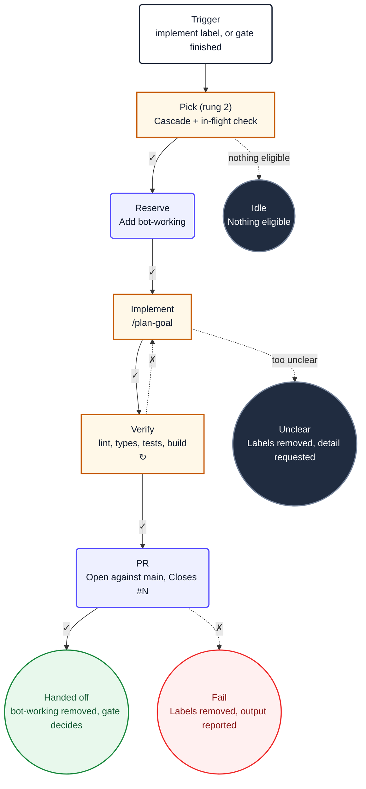

# The `## Diagram` section

Every Platform agentic workflow ends with a Mermaid flowchart, using the same visual language
as `.loops/recipes/*.yaml`, so a reader moving between them sees one convention.

---

## The prompt must exclude it

The body is the prompt, so a diagram in the body is read as instructions. Two things are
required, and neither is optional.

**One.** The diagram lives under a final `## Diagram` heading, after every numbered step.

**Two.** The last numbered step says, verbatim:

> Ignore the `## Diagram` section below. It is documentation for humans and contains no
> instructions for you.

---

## Node roles

Nodes are classified by role, not by appearance. Pick the role first, then the shape follows.

```
ROLE          SHAPE            CLASS      FILL        WHEN
─────         ──────           ─────      ────        ────
Trigger       ("label")        start      white       Exactly one per diagram. The `on:`
                                                      event. No edges in.

Decision      ["label"]        decision   orange      A step with both a pass and a fail
                                                      path: a gate, a check, a filter.

Action        ("label")        action     purple      A linear step: a precompute, the
                                                      agent run, a verification.

Safe output   (("label"))      success    green       A terminal that writes: comment
                                                      posted, branch pushed, PR merged.

Failure end   (("label"))      failure    red         A terminal failure path: labels
                                                      removed, the failure reported.

Idle end      (("label"))      idle       dark grey   A terminal no-op: the filter did
                                                      not match, nothing to do.
```

An idle end and a failure end are different things, and the distinction is worth keeping. A
filter that correctly declined to act is idle. A run that tried and could not finish is a
failure. Colouring "nothing to do" red trains people to ignore red.

## Showing the ladder

Where a decision was pushed down the ladder, the diagram should show where it now lives, so a
reader can see the deterministic part without opening the YAML. Mark rung-1 and rung-2 nodes:

```
implPick["Pick (rung 2)<br/>Priority cascade, pre-activation"]
```

A workflow whose diagram is all `action` and `success` nodes with no decisions is usually a
workflow that pushed nothing down and left every decision to the model.

## Lifecycle versus Actions graph

GitHub's visualization renders `needs:` edges. It is useful for debugging execution ordering,
but it is not the user-facing lifecycle. A final reporting job commonly depends on every job,
and mutually exclusive jobs can appear beside each other. Read those edges as "waits for", not
as "business state flows to".

The Mermaid diagram must show the lifecycle instead:

```text
command label or authorised reply → validate → reserve → agent → outcome
questions → keep command label and wait for reply → trigger again
complete → update item and transition terminal labels
```

Show response loops as a named back-edge from the question state to the trigger. Show mutually
exclusive terminal paths as branches from one outcome decision. Do not copy every generated
`activation`, `safe_outputs`, or `conclusion` edge into a lifecycle diagram unless it changes a
human-visible state.

---

## Class definitions

Copy these six lines verbatim. Do not retype them from memory, and do not adjust the colours
to taste: they are shared with `loop-task-diagram` and both conventions must stay identical.

```
classDef start fill:#ffffff,stroke:#172033,stroke-width:2px,color:#172033
classDef action fill:#eef0ff,stroke:#554cff,stroke-width:2px,color:#172033
classDef decision fill:#fff8e8,stroke:#c75b00,stroke-width:2px,color:#172033
classDef idle fill:#202c40,stroke:#738198,stroke-width:2px,color:#ffffff
classDef failure fill:#fff0f0,stroke:#ef2929,stroke-width:2px,color:#8b1a1a
classDef success fill:#e8f8ec,stroke:#18883c,stroke-width:2px,color:#145a32
```

All six must be present even when the diagram does not use all six classes. A reader
comparing two diagrams should not have to work out whether a missing class means "unused" or
"forgotten".

---

## Glyphs

```
CONCEPT                MERMAID                              NOTES
───────                ───────                              ─────
Direction              flowchart TD                         always top-down

Trigger node           prefixStart("Trigger<br/>event")     one per diagram, class start

Pass path              -->|✓| target                        solid arrow

Fail path              -.->|✗| target                       dashed arrow

Named path             -->|success| target                  when ✓/✗ is ambiguous, e.g.
                                                            a three-way CI conclusion

Retry / back-edge      ↻ or ↻N in the node label            only on the node the cycle
                                                            returns to

Node IDs               camelCase                            Mermaid rejects hyphens.
                                                            `impl-verify` becomes
                                                            `implVerify`. Never `end`.

Labels                 id["Short name<br/>Purpose"]         two lines, each under 40
                                                            characters, `<br/>` to break
```

Prefix every node ID with a short workflow tag (`impl`, `ref`, `gate`, `cost`) so that nodes
copied between diagrams do not collide and a reader can tell at a glance which workflow a
snippet came from.

Use named paths rather than ✓/✗ where a branch is genuinely not pass/fail. A CI conclusion has
three outcomes and labelling `cancelled` as ✗ misrepresents it: a cancelled run is not
evidence of anything.

---

## Worked example



---

## Checks

- [ ] The diagram is the last section, under `## Diagram`
- [ ] The final numbered prompt step carries the exclusion line verbatim
- [ ] `flowchart TD`
- [ ] Exactly one node of class `start`, with no incoming edges
- [ ] Every pass path is `-->|✓|` and every fail path is `-.->|✗|`, except where a named
      path is genuinely clearer
- [ ] Every terminal node is `(("double"))` and classed `success`, `failure` or `idle`
- [ ] All six `classDef` lines present verbatim
- [ ] Every node appears in exactly one `class` line
- [ ] Node IDs are camelCase, workflow-prefixed, and none is `end`
- [ ] Labels are two lines, each under 40 characters
- [ ] Rung-1 and rung-2 decisions are marked as such
- [ ] Every branch in the prompt body appears in the diagram, and vice versa
